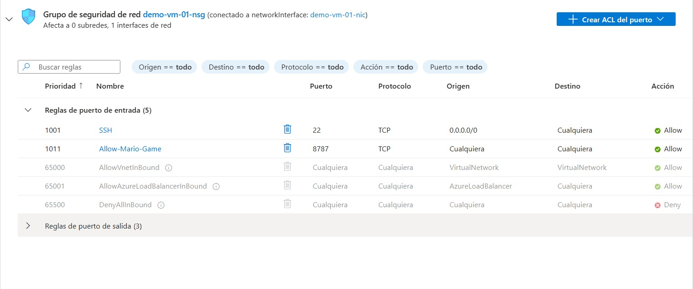
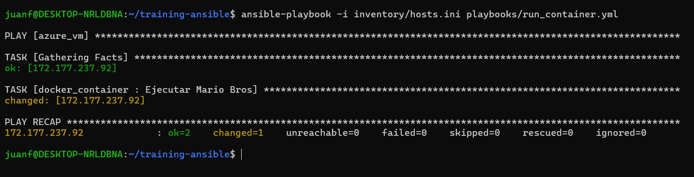
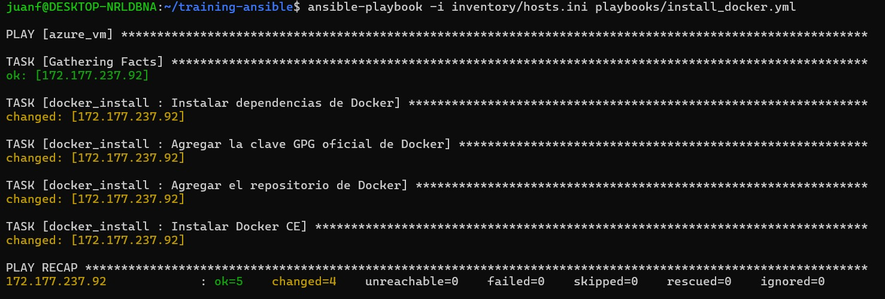
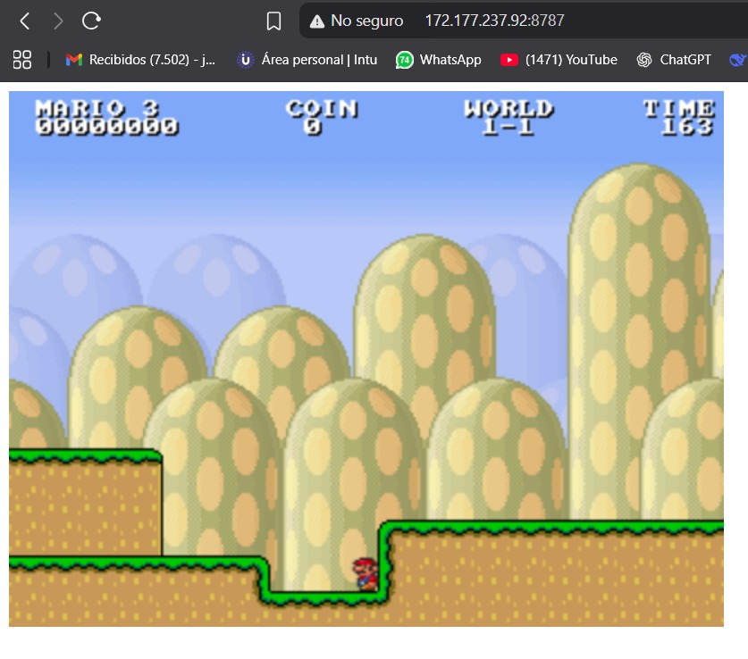

# Informe de Automatización: Despliegue de Contenedor en Azure con Ansible

**Autor:** Juan Jojoa Crespo - A00382042

Este documento detalla el proceso de automatización para la configuración de un entorno de Docker y el despliegue de una aplicación en contenedores sobre una máquina virtual (VM) en Microsoft Azure, utilizando Ansible como herramienta de orquestación.

## 1. Configuración del Inventario de Ansible

El primer paso consistió en definir el host objetivo para la automatización. Se configuró el archivo `inventory/hosts.ini` para incluir la dirección IP pública de la máquina virtual de Azure, junto con las credenciales de acceso necesarias para la conexión SSH.

**Archivo `inventory/hosts.ini`:**
```ini
[azure_vm]
172.177.237.92 ansible_user=vmadmin ansible_ssh_pass=VmAdmin!23456789
```

*   `[azure_vm]`: Define el grupo de hosts al que se aplicarán los playbooks.
*   `172.177.237.92`: Es la dirección IP pública de la VM en Azure.
*   `ansible_user`: Es el usuario con privilegios de administrador en la VM.
*   `ansible_ssh_pass`: Es la contraseña para la autenticación del usuario.
*   
## 2. Configuración de Red en Azure Portal

Para que la aplicación desplegada en el contenedor fuera accesible desde internet, fue necesario configurar una regla de entrada en el Grupo de Seguridad de Red (NSG) asociado a la VM. Se creó una regla para permitir el tráfico entrante a través del puerto **8787**.

**Detalles de la regla de entrada:**
*   **Prioridad:** 1011
*   **Nombre:** `Allow-Mario-Game`
*   **Puerto:** 8787
*   **Protocolo:** TCP
*   **Origen:** Cualquiera
*   **Acción:** Permitir (Allow)



## 3. Ejecución de Playbooks de Ansible

Se utilizaron dos playbooks principales para llevar a cabo la automatización completa.

### 3.1. Instalación de Docker

El primer playbook, `install_docker.yml`, se encargó de preparar el sistema operativo, agregar el repositorio oficial de Docker e instalar el motor de contenedores en la VM.

**Comando de ejecución:**
```bash
ansible-playbook -i inventory/hosts.ini playbooks/install_docker.yml
```

La ejecución fue exitosa, realizando todos los cambios necesarios en el host remoto.



### 3.2. Despliegue del Contenedor

El segundo playbook, `run_container.yml`, utilizó el motor de Docker previamente instalado para descargar la imagen de la aplicación (Super Mario) y ejecutarla como un contenedor, mapeando el puerto interno `8080` al puerto `8787` de la VM.

**Comando de ejecución:**
```bash
ansible-playbook -i inventory/hosts.ini playbooks/run_container.yml
```

El playbook se ejecutó correctamente, confirmando el despliegue del contenedor.



## 4. Resultado Final

Tras completar exitosamente los pasos de automatización y la configuración de red, la aplicación quedó desplegada y accesible públicamente. Se validó el acceso a través de un navegador web, ingresando a la dirección `http://172.177.237.92:8787`.

El resultado confirma que el contenedor se está ejecutando correctamente y que el puerto ha sido expuesto de manera adecuada, mostrando la aplicación funcional.





## Conclusión

El uso de Ansible permitió automatizar de manera eficiente y repetible todo el proceso de configuración y despliegue, desde la instalación de dependencias hasta la ejecución de la aplicación final. Este enfoque minimiza los errores manuales y establece una base sólida para futuras automatizaciones de infraestructura como código (IaC).
